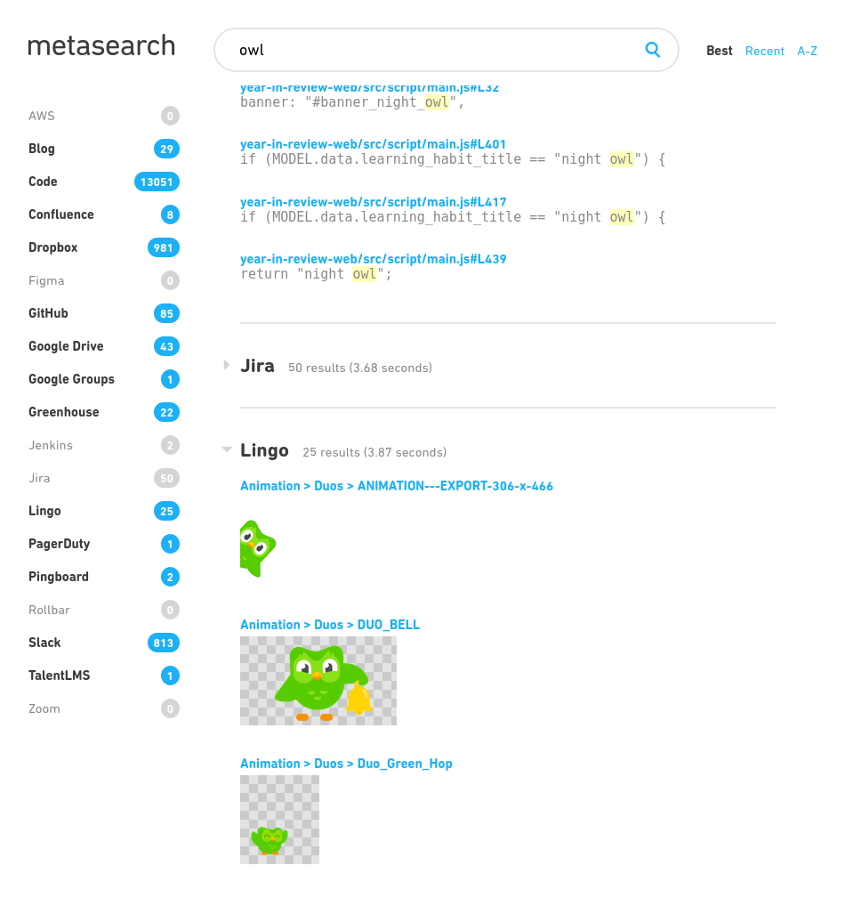

# Metasearch

Metasearch is a tool for searching many other tools in parallel:

The full list of supported data sources:

- [AWS](https://aws.amazon.com/) tagged resources
- [Confluence](https://www.atlassian.com/software/confluence) pages
- [Dropbox](https://www.dropbox.com/) files and folders
- [Figma](https://www.figma.com/) files, projects, and teams
- [GitHub](https://github.com/) PRs, issues, and repo metadata
- [GitLab](https://gitlab.com/) merge-requests
- [Google Drive](https://www.google.com/drive/) docs, spreadsheets, etc.
- [Google Groups](https://groups.google.com/) groups
- [Greenhouse](https://www.greenhouse.io/) job posts
- [Guru](https://www.getguru.com/) cards
- [Hound](https://github.com/hound-search/hound) indexed code
- [Jenkins](https://www.jenkins.io/) job names
- [Jira](https://www.atlassian.com/software/jira) issues
- [Lingo](https://www.lingoapp.com/) assets
- [Mattermost](https://mattermost.com/) posts
- [Notion](https://www.notion.so/) pages
- [PagerDuty](https://www.pagerduty.com/) schedules and services
- [Pingboard](https://pingboard.com/) employees
- [Rollbar](https://rollbar.com/) projects
- [Slack](https://slack.com/) messages and channels
- [TalentLMS](https://www.talentlms.com/) courses
- [Trello](https://trello.com/en-US) boards, cards, members and workspaces
- [Zoom](https://zoom.us/) rooms
- Arbitrary websites via sitemaps

## Setup

### Using Docker

1. Download and customize [`config.yaml`](https://github.com/duolingo/metasearch/raw/master/config.yaml)
2. In the local directory that contains `config.yaml`, run `docker run -p 3000:3000 -v "$PWD:/data" duolingo/metasearch`

#### Theming

1. In order to customize the theme, place the [`theme`](https://github.com/duolingo/metasearch/tree/master/dist/theme)
directory in a local folder
2. Customize the contents of the theme folder
3. mount the `theme` folder in the docker container: `docker run -p 3000:3000 -v "$PWD:/code/dist/theme" ...`

### Using Git, Make, and Node.js

1. Clone this repo and customize its `config.yaml`
1. Run `make`

Metasearch runs at http://localhost:3000.

## Contributing

Want to search something like SharePoint or MediaWiki that isn't currently supported? This repo is only around 3000 lines of TypeScript, and [adding support](https://github.com/duolingo/metasearch/pull/11) for a new data source requires fewer than 100 lines on average. Feel free to open a PR!

---

_Duolingo is hiring! Apply at https://www.duolingo.com/careers_
